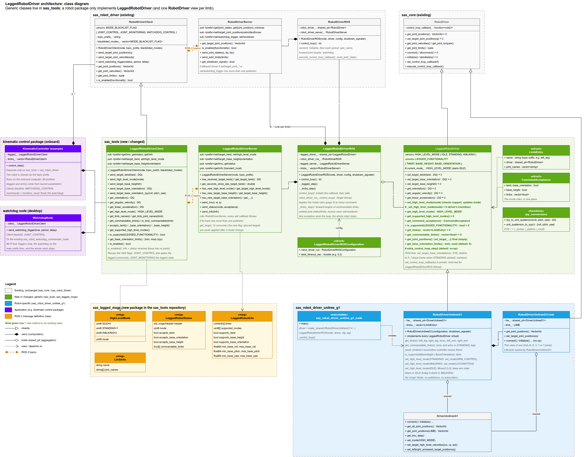

# sas_tools
Utility tools and interfaces for the SmartArmStack framework.

The main tool is a **standard for legged robot drivers**. A control package (e.g. a kinematic controller)
uses `LeggedRobotDriverClient`, and works with any robot whose driver implements `LeggedRobotDriver`
(e.g. Unitree G1, B1 + Z1, H1). Replacing the robot only changes the topic prefixes in the launch file.

## Packages

| Package | Description |
|---|---|
| [sas_tools](sas_tools) | `LeggedRobotDriver` interface, `LeggedRobotDriverROS`, `LeggedRobotDriverServer`, `LeggedRobotDriverClient`, and RPY conversions |
| [sas_legged_msgs](sas_legged_msgs) | Messages of the legged robot driver standard (`HighLevelMode`, `LeggedRobotStatus`, `LeggedRobotInfo`) |

## Install

Requires ROS 2 Jazzy, [DQ Robotics](https://github.com/dqrobotics/cpp), and the SmartArmStack packages
`sas_core`, `sas_common` and `sas_robot_driver`.

Clone the repository into the `src` folder of your workspace; `colcon build` finds both packages:

```shell
cd ~/ros2_ws/src
git clone https://github.com/Adorno-Lab/sas_tools
cd ~/ros2_ws
colcon build --packages-up-to sas_tools
```

## Architecture



| Class | Role |
|---|---|
| `LeggedRobotDriver` | Hardware interface of a legged robot. Does not use ROS. Each robot driver inherits from it and implements its virtual methods. |
| `LeggedRobotDriverROS` | Runs a `LeggedRobotDriver` on the standard topics. It reuses the SAS `RobotDriverROS` loop (connect, initialize, timing, joint topics, watchdog) and adds the legged topics through the control loop callback. |
| `LeggedRobotDriverServer` | The legged topics on the driver side. It stores the latest commands and publishes the state; it knows nothing about the robot. |
| `LeggedRobotDriverClient` | The client of a legged robot. It extends the SAS `RobotDriverClient` with the legged topics. |

Everything runs in a single thread: any exception (a lost watchdog, a second commanding client, a driver
error) ends the loop, and the whole robot stops.

The full design (classes, runtime, topic standard, and one control loop iteration) is in [design/UML](design/UML).

## Topic standard

Every legged robot driver exposes these topics under its prefix (e.g. `sas_g1/g1_1`):

| Topic | Type | Direction | Client flag |
|---|---|---|---|
| `get/joint_states` | `sensor_msgs/JointState` | server → client | `JOINT_MONITORING` |
| `get/joint_positions_min`, `get/joint_positions_max` | `std_msgs/Float64MultiArray` | server → client | `JOINT_MONITORING` |
| `get/info` | `sas_legged_msgs/LeggedRobotInfo` (transient_local) | server → client | `JOINT_MONITORING` |
| `get/status` | `sas_legged_msgs/LeggedRobotStatus` | server → client | `JOINT_MONITORING` |
| `get/imu` | `sensor_msgs/Imu` | server → client | `JOINT_MONITORING` |
| `set/target_joint_positions` (and `_velocities`, `_forces`) | `std_msgs/Float64MultiArray` | client → server | `JOINT_CONTROL` |
| `set/high_level_mode` | `sas_legged_msgs/HighLevelMode` | client → server | `JOINT_CONTROL` |
| `set/target_twist` | `geometry_msgs/TwistStamped` | client → server | `JOINT_CONTROL` |
| `set/target_base_height` | `std_msgs/Float64` | client → server | `JOINT_CONTROL` |
| `set/target_base_orientation` | `geometry_msgs/QuaternionStamped` | client → server | `JOINT_CONTROL` |
| `set/watchdog_trigger` | `sas_msgs/WatchdogTrigger` | client → server | `WATCHDOG_CONTROL` |
| `set/shutdown` | `sas_msgs/Bool` | client → server | any client |

- The joint topics are the standard SAS `RobotDriverServer` topics.
- The `set/` topics, except `set/shutdown`, accept a **single publisher**: a second one makes the server
  throw, which stops the driver.
- `get/joint_states` reports every joint of the robot. `get/status` tells which of them take
  `set/target_joint_positions` in the current mode (`commandable_joints`).
- Manipulators served by the legged driver (e.g. the arms and the waist of the G1) are standard SAS
  robot drivers under `<prefix>/<name>` (e.g. `sas_g1/g1_1/left_arm`), used with `RobotDriverClient`.

### Client roles

The client flag is the SAS `MODE_BLACKLIST_FLAG` that creates the topic on the client side; blacklisting
it removes the topic.

| Node | Runs on | Blacklist | Can |
|---|---|---|---|
| Kinematic controller | onboard computer | `WATCHDOG_CONTROL` | command and monitor (the only commanding client) |
| Watchdog node | desktop computer | `JOINT_CONTROL` | watchdog and monitor (the only watchdog client) |
| Monitors (RViz, loggers) | anywhere | `JOINT_CONTROL`, `WATCHDOG_CONTROL` | monitor only |

If the network between the desktop and the robot fails, the watchdog triggers stop arriving and the robot
stops. The watchdog also checks the delay of each trigger, so the clocks of both computers must be
synchronized (e.g. with chrony).

### High-level modes

`LeggedRobotDriverROS` only passes a command to the driver if the current mode accepts it, and reports what
is accepted in `get/status`. The driver starts in `IDLE`.

| Mode | Twist | Base orientation | Base height | Arm targets |
|---|---|---|---|---|
| `IDLE` | ignored (zero velocity sent) | ignored | ignored | ignored, the arms hold still |
| `STANDING` | ignored (zero velocity sent) | accepted, if supported | accepted, if supported | accepted |
| `WALKING` | accepted | ignored | accepted, if supported | accepted only if `MANIPULATION_WHILE_WALKING` is supported |

- In `IDLE`, the robot stays on and balancing. It never enters a damping mode or lies down, since it could fall.
- If no twist arrives within `twist_timeout_sec` (0.2 s by default), a zero twist is sent.
- Each driver manages its own mode changes (e.g. stopping before switching from `WALKING` to `STANDING`).

### Base orientation

The target base orientation is given as ZYX roll-pitch-yaw angles, `r = r_z(yaw) r_y(pitch) r_x(roll)`,
relative to the frame **F_f**: the base frame at the moment the robot entered `STANDING`. Thus, (0, 0, 0)
keeps the pose the robot had when `STANDING` started. `LeggedRobotDriverROS` clamps each angle to the
limits of the robot, which do not need to be symmetric and are published in `get/info`.

`get/imu` reports the raw IMU orientation instead, in the IMU's own world frame (its yaw can drift).

## Usage

### Writing a driver

Inherit from `LeggedRobotDriver` and implement its pure virtual methods. A driver does not use ROS.

```cpp
#include <sas_tools/LeggedRobotDriver.hpp>

class RobotDriverMyRobot: public sas::LeggedRobotDriver
{
protected:
    // Robot-specific mode change. Only called with a supported mode that differs from the current one.
    void _set_high_level_mode(const HIGH_LEVEL_MODE& mode) override;

public:
    RobotDriverMyRobot(const std::shared_ptr<sas::ShutdownSignaler>& shutdown_signaler);

    // RobotDriver
    VectorXd get_joint_positions() override;
    void set_target_joint_positions(const VectorXd& q) override; // ignore the entries that are not commandable
    void connect() override;
    void disconnect() override;
    void initialize() override;
    void deinitialize() override;

    // Base commands
    void set_target_twist(const DQ& twist) override;                  // must accept a zero twist in every mode
    void set_target_base_orientation(const DQ& r) override;
    void set_target_base_height(const double& base_height) override;

    // IMU
    DQ get_orientation() override;                                     // DQ(0) until a reading is available
    DQ get_angular_velocity() override;
    DQ get_linear_acceleration() override;

    // Description
    std::vector<HIGH_LEVEL_MODE> get_supported_high_level_modes() const override;
    bool is_supported(const LEGGED_FUNCTIONALITY& functionality) const override;
    std::vector<std::string> get_joint_names() const override;
    std::vector<bool> get_commandable_joint_mask() const override;
};
```

Optional overrides:

| Method | Default | Override it when |
|---|---|---|
| `get_base_orientation_limits()` | zeros | the robot supports `BASE_ORIENTATION` |
| `get_manipulators()` | empty | the driver also serves arms (e.g. the G1 arms and waist) |
| `extra_control_loop_step()` | no-op | the robot publishes extra data (e.g. the B1 battery) |
| `get_joint_velocities()`, `get_joint_torques()` | throw | the robot reports them |

> [!IMPORTANT]
> Set the joint limits of the driver and of each manipulator (`set_joint_limits()`). The SAS
> `RobotDriverClient::is_enabled()` stays false until it receives them, so a client never becomes enabled.

Do not call `set_control_loop_callback()`: the control loop callback belongs to `LeggedRobotDriverROS`.

### Running the driver

```cpp
#include <sas_tools/sas_legged_robot_driver_ros.hpp>

auto driver = std::make_shared<RobotDriverMyRobot>(shutdown_signaler);

sas::LeggedRobotDriverROSConfiguration configuration;
configuration.robot_driver_ros.robot_driver_provider_prefix = "sas_my_robot/robot_1";
configuration.robot_driver_ros.thread_sampling_time_sec = 0.002;
configuration.twist_timeout_sec = 0.2;

sas::LeggedRobotDriverROS legged_robot_driver_ros(node, driver, configuration, shutdown_signaler);
legged_robot_driver_ros.control_loop();
```

### Commanding the robot

The kinematic controller uses a `LeggedRobotDriverClient` for the robot and one `RobotDriverClient` per
manipulator, all with `WATCHDOG_CONTROL` blacklisted. The prefixes come from the launch parameters.

```cpp
#include <sas_tools/sas_legged_robot_driver_client.hpp>

using MODE_BLACKLIST_FLAG = sas::RobotDriverClient::MODE_BLACKLIST_FLAG;
using HIGH_LEVEL_MODE = sas::LeggedRobotDriver::HIGH_LEVEL_MODE;

sas::LeggedRobotDriverClient robot(node, "sas_g1/g1_1", {MODE_BLACKLIST_FLAG::WATCHDOG_CONTROL});
sas::RobotDriverClient left_arm(node, "sas_g1/g1_1/left_arm", {MODE_BLACKLIST_FLAG::WATCHDOG_CONTROL});

// Wait until robot.is_enabled() and left_arm.is_enabled(), spinning the node.

robot.send_high_level_mode(HIGH_LEVEL_MODE::WALKING);
robot.send_target_twist(DQ(0, 0, 0, 0.2, 0, 0.3, 0, 0));    // wz = 0.2 rad/s, vx = 0.3 m/s (angular + E_*linear)

robot.send_high_level_mode(HIGH_LEVEL_MODE::STANDING);
if (robot.accepts_base_orientation())
    robot.send_target_base_orientation_rpy(0.0, 0.1, 0.0);  // roll, pitch, yaw relative to F_f
left_arm.send_target_joint_positions(q_left_arm);

const DQ r = robot.get_orientation();                       // IMU orientation
const std::vector<std::string> joint_names = robot.get_joint_names();
```

To check that the controller is connected to the robot it expects, compare `get_joint_names()` with its
kinematic model.

### Watchdog

The watchdog runs in a separate node, on another computer, with `JOINT_CONTROL` blacklisted. The existing
`sas_robot_watchdog_commander_node` can be used, or:

```cpp
sas::LeggedRobotDriverClient watchdog(node, "sas_g1/g1_1", {MODE_BLACKLIST_FLAG::JOINT_CONTROL});
watchdog.send_watchdog_trigger(true, 1.0, 0.5);  // status, period, maximum acceptable delay (seconds)
```

Only the main prefix has a watchdog; a watchdog failure stops the whole robot, including its manipulators.
